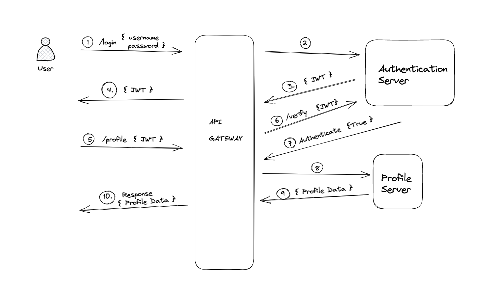

# API GATEWAY

## PLAN

To Create something like this

## REFERENCES
- https://www.nginx.com/blog/authenticating-api-clients-jwt-nginx-plus/
- https://www.nginx.com/blog/deploying-nginx-plus-as-an-api-gateway-part-1/
- https://learnk8s.io/kubernetes-ingress-api-gateway
- https://www.wwt.com/video/api-security-with-oauth20-using-jwt-tokens